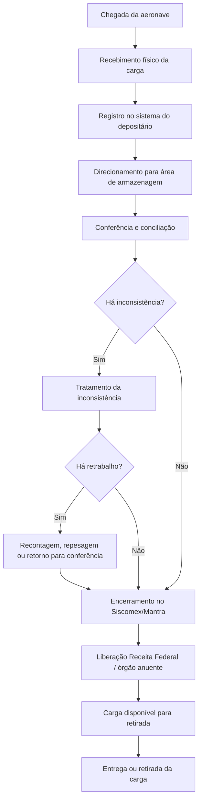

# Fluxo Operacional

Este documento descreve o fluxo operacional considerado no projeto **Airport Cargo Operations Analytics**.

O projeto simula a jornada da carga aérea de importação em um aeroporto internacional brasileiro genérico, desde a chegada da aeronave até a entrega ou retirada da carga.

## Fluxo Geral

## Etapas do Processo

### 1. Chegada da aeronave

Marco inicial do processo. A partir deste momento, começa a contagem dos tempos operacionais e regulatórios relacionados ao recebimento e encerramento no Siscomex/Mantra.

### 2. Recebimento físico da carga

Etapa em que a carga é descarregada, recebida e movimentada para controle do fiel depositário.

### 3. Registro no sistema do depositário

Momento em que a carga recebida passa a constar no sistema operacional interno do depositário.

### 4. Armazenagem conforme natureza declarada

A carga deve ser direcionada para área compatível com sua natureza declarada, como carga geral, perecível, refrigerada, DGR/carga perigosa, valiosa, avariada ou pendente.

### 5. Conferência e conciliação

Etapa de validação entre a carga recebida fisicamente e as informações declaradas no Siscomex/Mantra pela companhia aérea.

### 6. Tratamento de inconsistências

Inclui divergências de peso, volume, ausência de identificação, DSIC, avarias, violações, indícios de furto, ausência de natureza da carga ou erro de manifesto.

### 7. Retrabalho operacional

Quando necessário, a carga pode retornar para conferência, recontagem, repesagem ou nova validação antes do encerramento.

### 8. Encerramento no Siscomex/Mantra

Marco regulatório e operacional do projeto. O tempo até este evento será utilizado para medir conformidade e identificar gargalos entre o recebimento no sistema do depositário e o encerramento oficial.

### 9. Liberação aduaneira ou anuência externa

Após o encerramento, a carga pode depender de liberação da Receita Federal ou de órgãos anuentes, conforme sua natureza e exigências aplicáveis.

### 10. Disponibilização e entrega

Após liberada, a carga fica disponível para retirada pelo importador, representante, despachante, transportadora ou cliente autorizado.

## Observação Analítica

O projeto diferencia o tempo total da carga no terminal dos tempos sob responsabilidade direta do fiel depositário.

Essa separação permite avaliar a performance operacional de forma mais justa, distinguindo gargalos internos de atrasos causados por companhia aérea, Receita Federal, órgãos anuentes, importadores, despachantes ou transportadoras.
